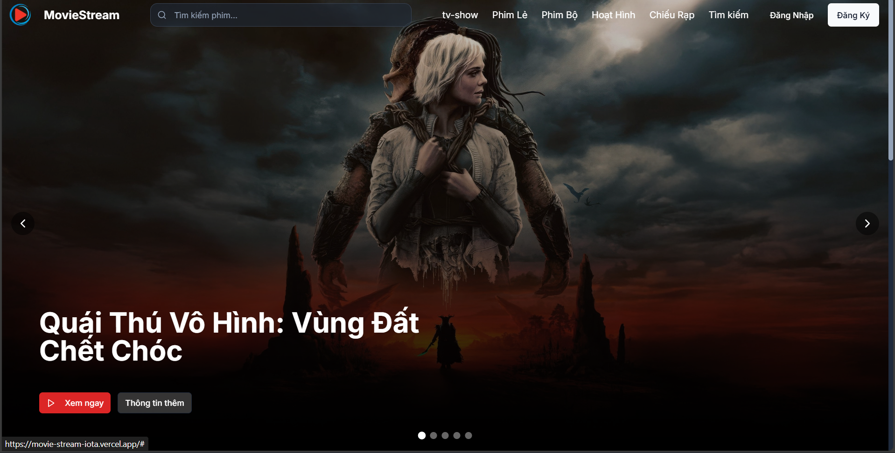
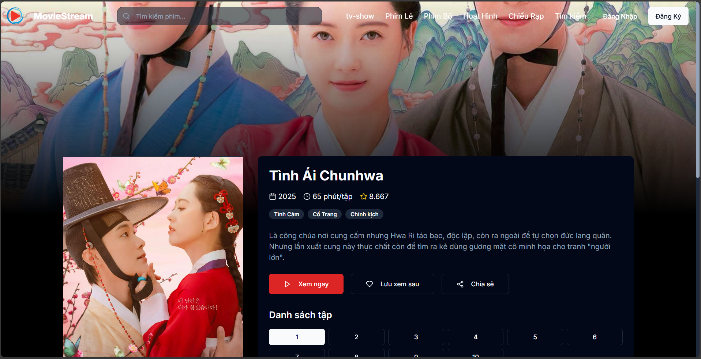
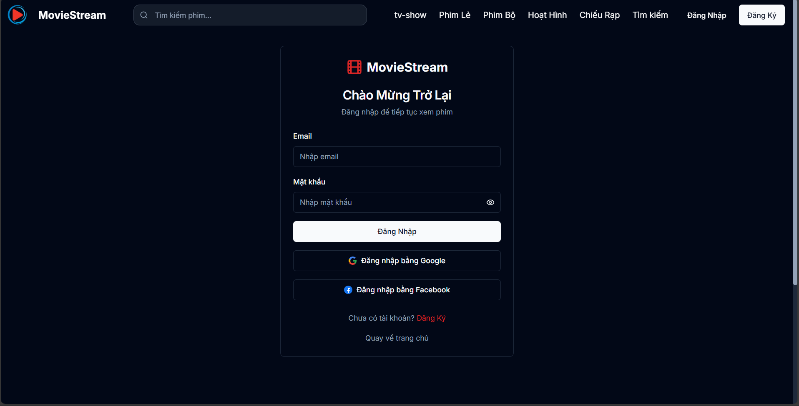
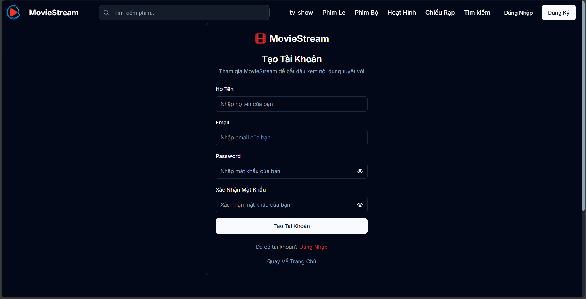
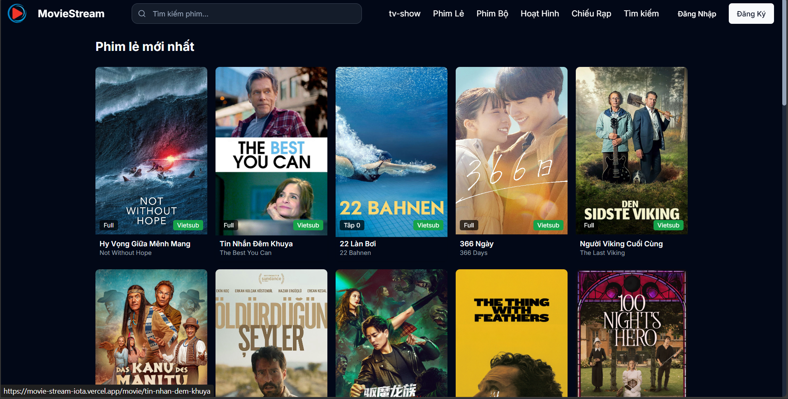

# Đề tài: PHÁT TRIỂN ỨNG DỤNG WEB XEM PHIM MOVIESTREAM ĐA NỀN TẢNG TỐI ƯU HÓA HIỆU NĂNG VỚI KIẾN TRÚC NEXTJS VÀ PWA
**Sinh viên thực hiện:** Nguyễn Văn Hiếu - MSSV: 21810310602

## 🛠 Công nghệ sử dụng
- Backend & Frontend (Fullstack): Next.js 14 (App Router), TypeScript
- Database: MongoDB (thông qua Prisma ORM )
- Styling: Tailwind CSS , Shadcn UI (Radix UI + Lucide Icons)
- Authentication: NextAuth.js v4
- State Management & Data Fetching: SWR, React Hook Form, Zod
- Payment Integration: VNPay (tích hợp custom)

## 🚀 Hướng dẫn cài đặt
1. Clone repo: `git clone https://github.com/nguyenvanhieu6732/MovieStream.git`
thêm file .env.local và .env cùng cấp với app
2. chạy câu lệnh: npm i
3. chạy câu lệnh: npx prisma generate 
4. chạy câu lệnh: npx prisma db push   
5. chạy câu lệnh: npx prisma db seed    
6. chạy câu lệnh: npm run dev

## 📸 Hình ảnh Demo

